# Prespective Transformation and Pin Hole Geometry

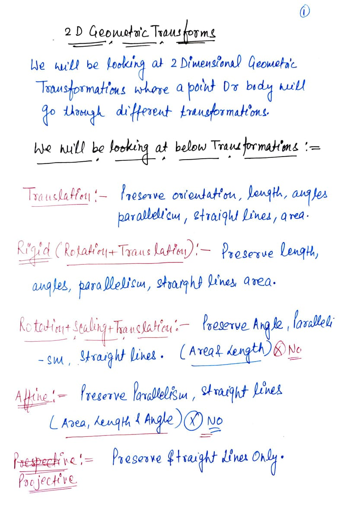

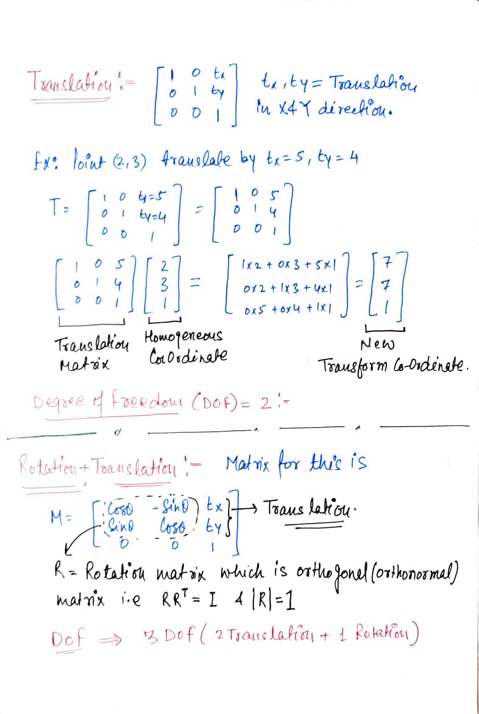

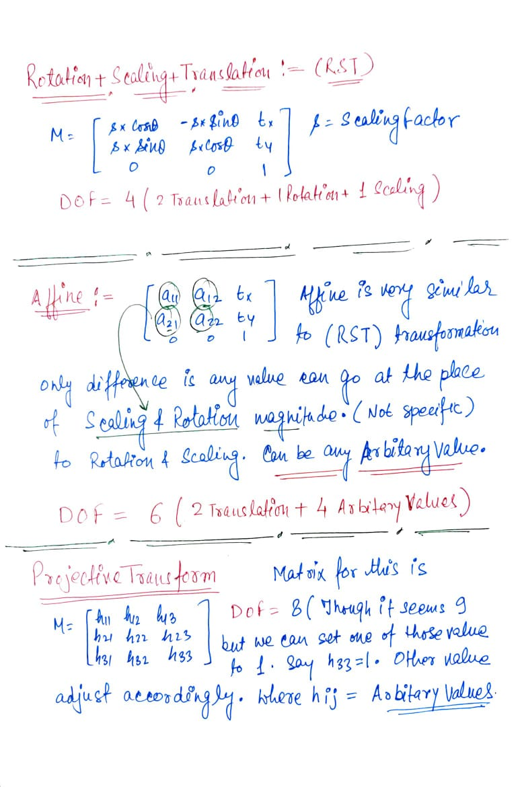

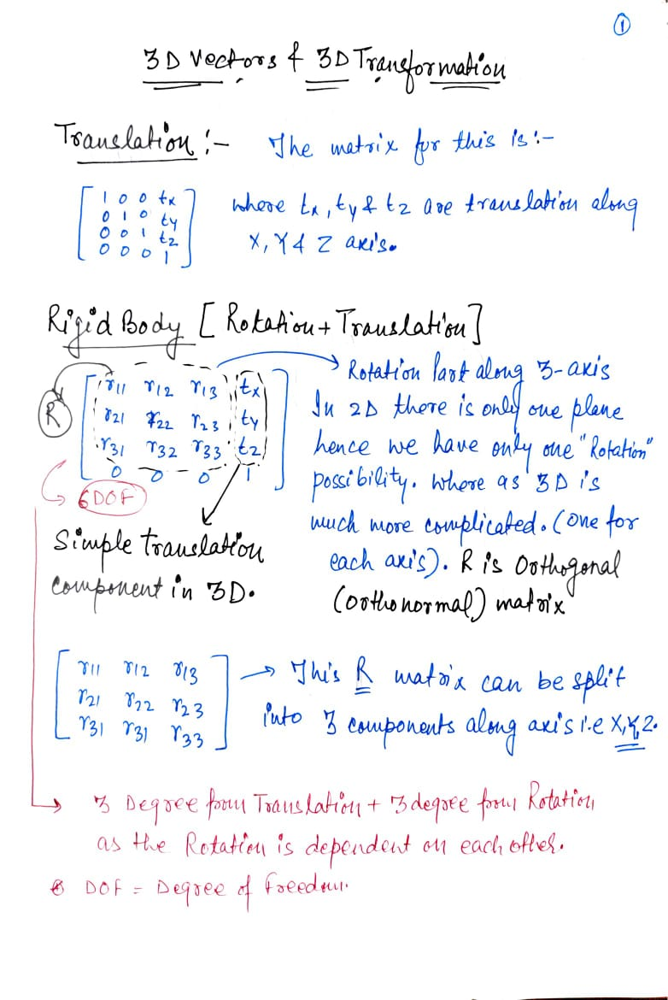

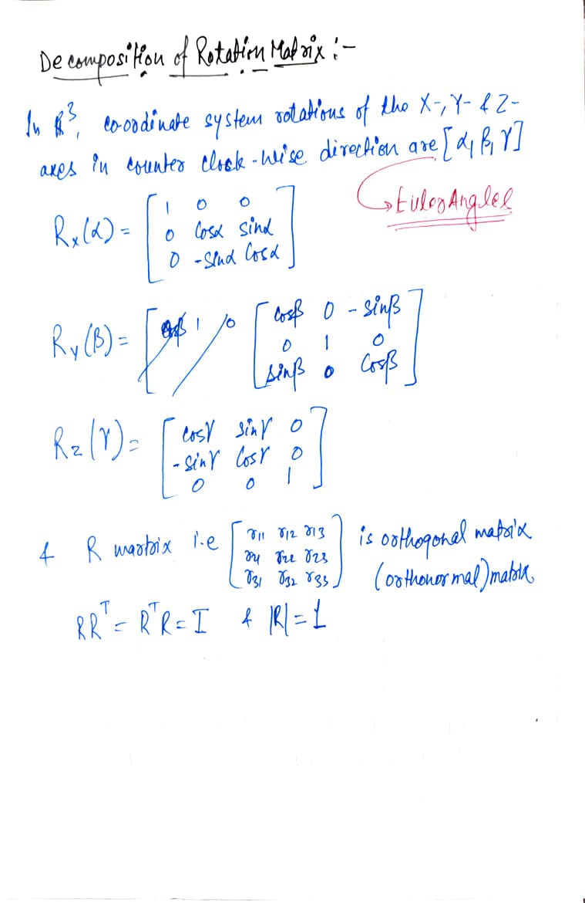

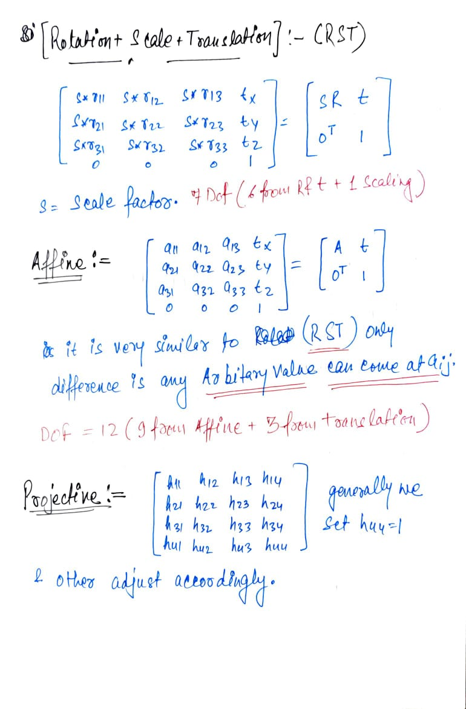

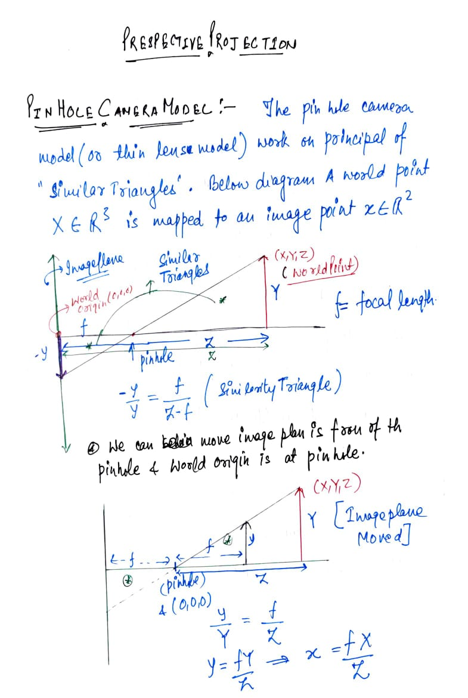

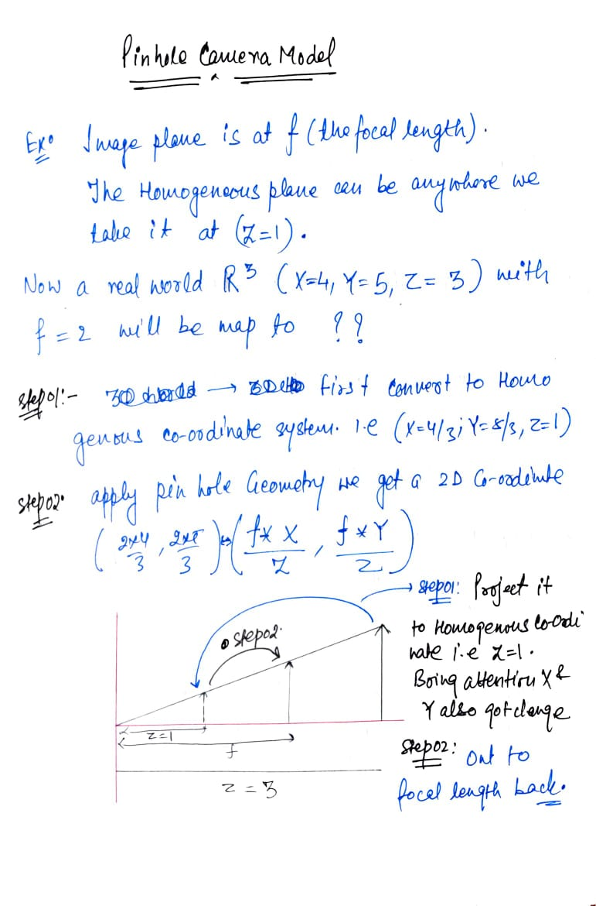

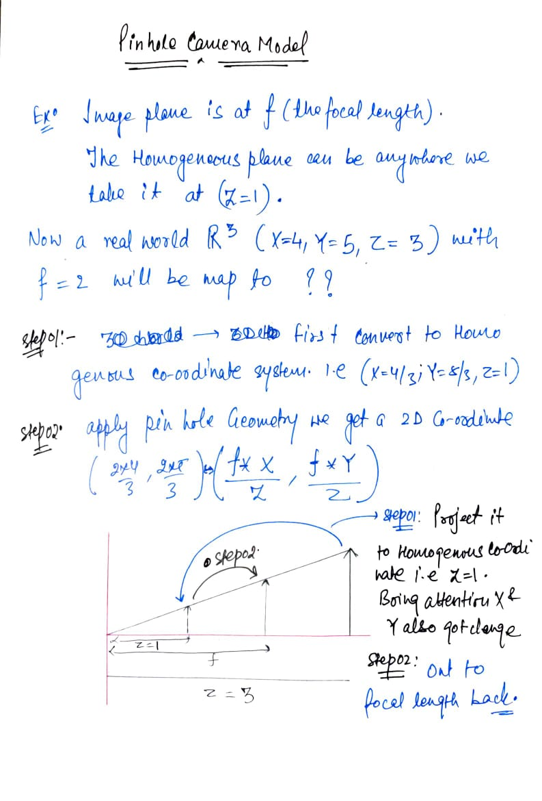

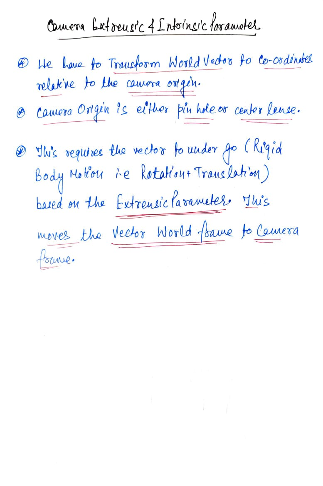

| 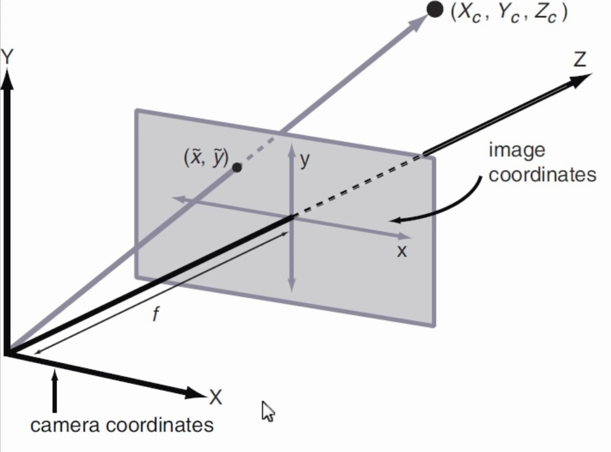 | 
| ----|
|The above image shows the postion of a Real World Point Xc, Yc and Zc along with the Image plane. As we can see in image plane (0,0) is at the middle of the image. Where as in practical usage example OpenCV (0,0) is at the Upper Left. This kind of transformation is handled by the camera Inrinsic Params.
||

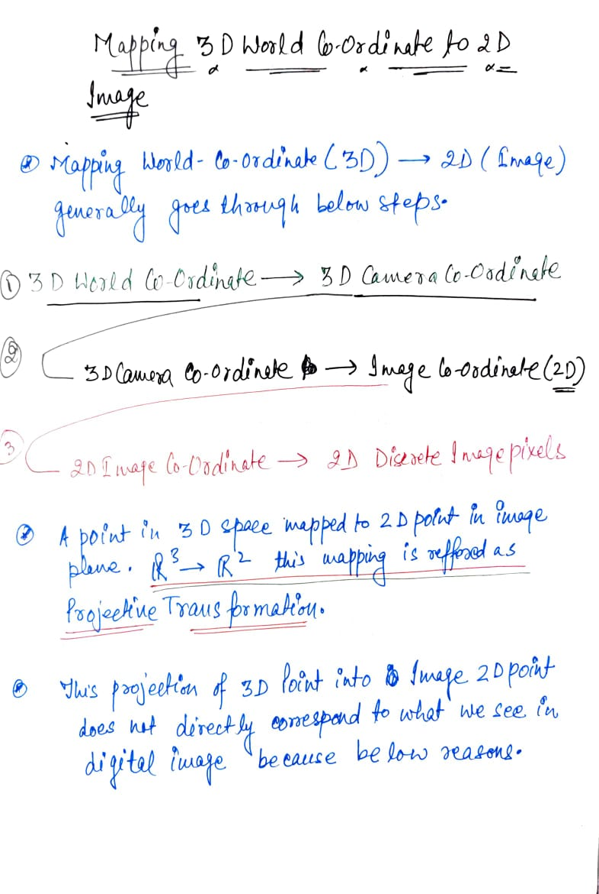

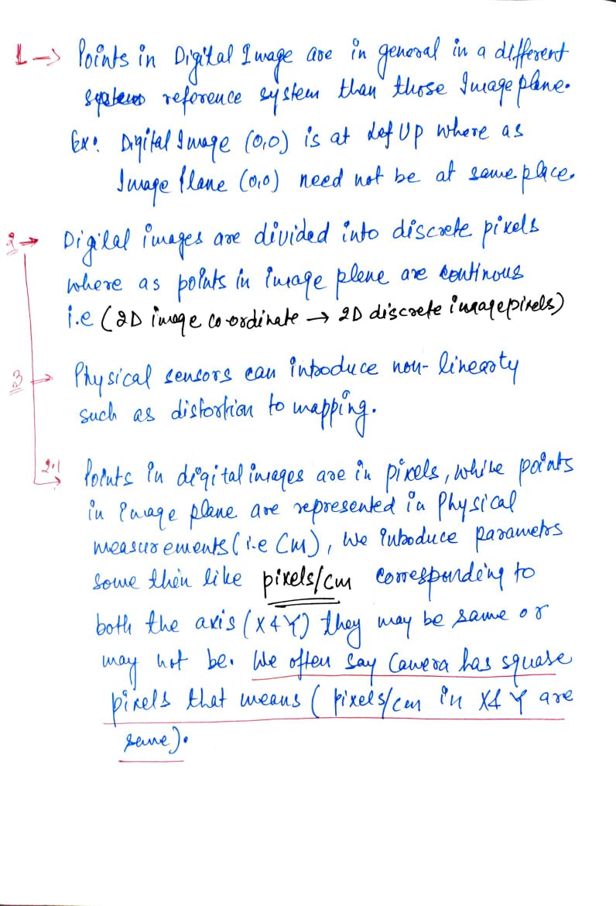

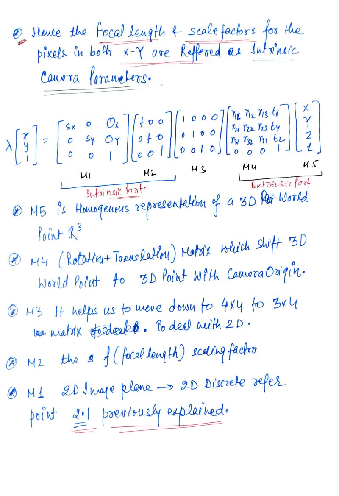

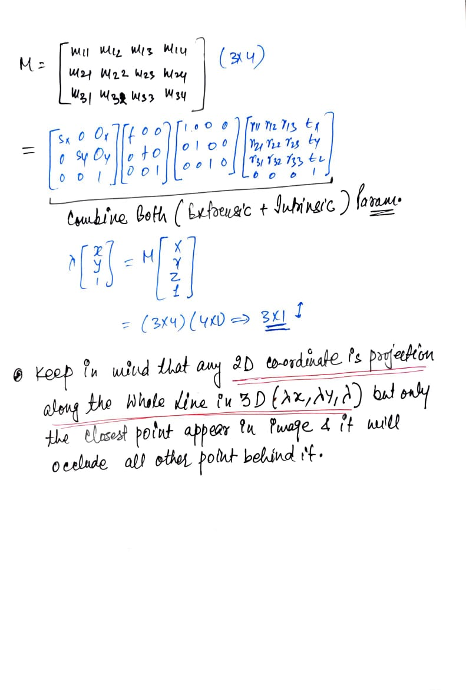