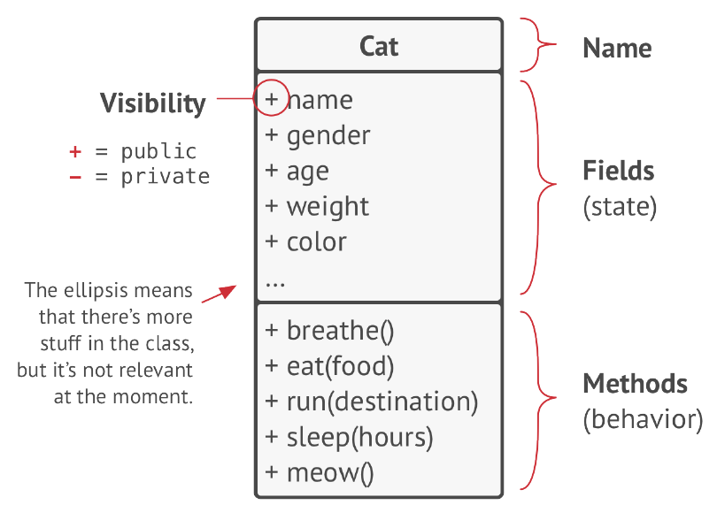
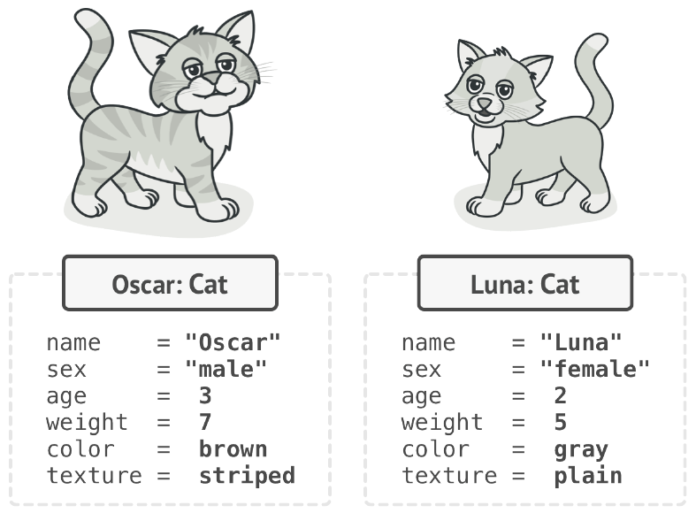
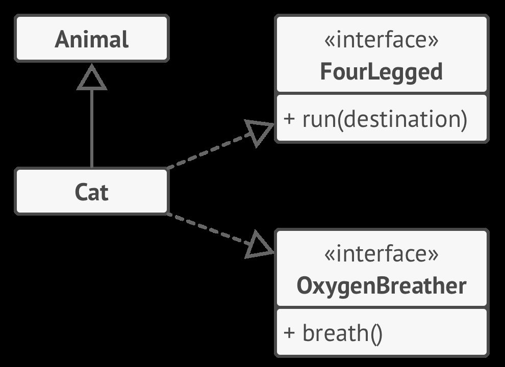
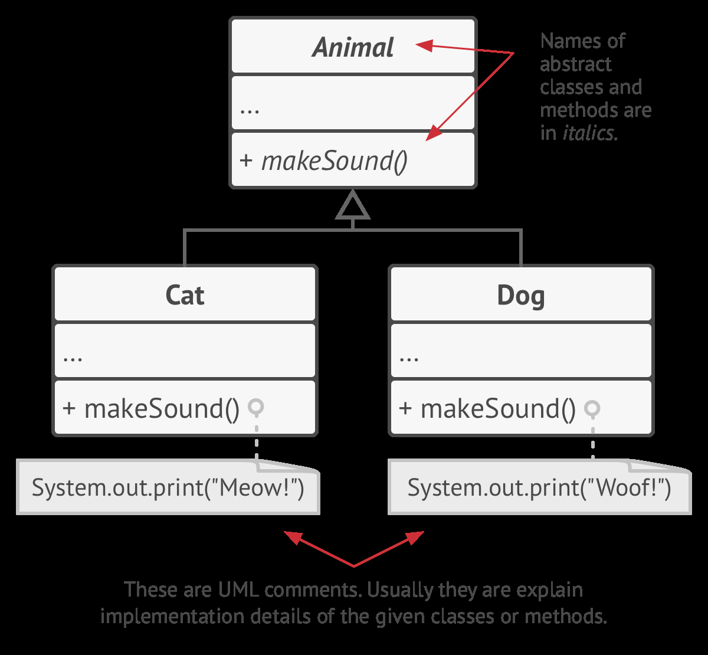

# Objects and Classes
Data stored inside the object’s fields is often referenced
as state, and all the object’s methods define its behavior.


---
## Objects are state instances of classes. 


## **Think in Objects**
Thinking in objects is about modeling your software around real-world entities or abstractions that make up the problem domain. The goal is to translate the problem into a set of objects that represent the key components and their interactions.

---

### **How to Identify Objects?**

1. **Analyze the Problem Statement:**
   - Look for nouns, which often correspond to potential objects.
   - Example from *Rick’s Guitar problem*:
     - "Rick wants a system to search his inventory of guitars for customers."
     - **Nouns**: Rick, System, Inventory, Guitars, Customers.

2. **Identify Responsibilities:**
   - What does each object need to do?
   - Objects should encapsulate data and behavior related to their responsibilities.

3. **Define Relationships:**
   - How do objects interact? For example:
     - **Inventory** contains **Guitar** objects.
     - **System** interacts with **Inventory** to find **Guitar** for a **Customer**.

---

### **Example: Thinking in Objects**

#### **Problem Statement:**
Design a library management system that allows users to borrow and return books. The system tracks books, members, and borrowing history.

#### **Step 1: Identify Potential Objects**
- **Nouns** in the problem: Library, Book, Member, Borrowing History, System.

#### **Step 2: Filter Relevant Objects**
Some nouns might not directly translate into objects. For example:
- "System" might just represent the overall program.
- "Borrowing History" could be an attribute or behavior of another object.

Filtered Objects:
- **Library**: Represents the overall management of books and members.
- **Book**: Represents the books available for borrowing.
- **Member**: Represents the users who can borrow books.

#### **Step 3: Define Object Responsibilities**
- **Library**: Manages the collection of books and members.
- **Book**: Tracks title, author, and availability.
- **Member**: Tracks member details and borrowing privileges.

#### **Step 4: Define Relationships**
- A **Library** contains many **Books**.
- A **Member** interacts with the **Library** to borrow or return **Books**.

#### **Resulting Objects:**
1. **Book**:
   - Attributes: `title`, `author`, `isAvailable`.
   - Behaviors: `borrow()`, `returnBook()`.

2. **Member**:
   - Attributes: `name`, `id`, `borrowedBooks`.
   - Behaviors: `borrowBook()`, `returnBook()`.

3. **Library**:
   - Attributes: `books`, `members`.
   - Behaviors: `addBook()`, `registerMember()`, `findBook()`.

---

### **Rules of Thumb for Identifying Objects**
1. **Focus on the Domain:**
   - Understand the problem domain and identify key entities.
   - Objects should represent either real-world entities (e.g., Guitar, Book) or abstractions (e.g., Inventory, Library).

2. **Look for Nouns in the Problem Statement:**
   - Nouns often translate into potential objects.
   - Example: “Rick wants to search his inventory of guitars” -> Guitar, Inventory.

3. **Objects Represent Responsibilities:**
   - Each object should have a clear role or responsibility.
   - Avoid "God objects" that handle too many unrelated responsibilities.

Let’s work through a **real-world problem** step by step, breaking it into objects. 

---

## **Real-World Problem: Online Food Ordering System**
Imagine you are tasked with designing a system for an online food ordering platform like UberEats or DoorDash. 

---

### **Step 1: Understand the Problem Statement**
The system should allow users to:
- Browse a list of restaurants.
- View restaurant menus.
- Place an order.
- Track order delivery.

Other aspects include:
- Restaurants should manage their menu items.
- Delivery personnel should track and deliver orders.
- The platform should handle payments.

---

### **Step 2: Identify Potential Objects**
Extract **nouns** from the problem statement:
- Users
- Restaurants
- Menus
- Orders
- Delivery personnel
- Payments
- Food items

Not all these nouns will translate into objects, but they’re a good starting point.

---

### **Step 3: Filter and Define Relevant Objects**
Some nouns might be too broad or serve as attributes rather than standalone objects. After analysis:
- **Restaurant**: Represents restaurants registered on the platform.
- **Menu**: Represents the menu of a restaurant.
- **MenuItem**: Represents individual food items on a menu.
- **User**: Represents the customers placing orders.
- **Order**: Represents an order placed by a user.
- **DeliveryPersonnel**: Represents the person delivering the order.
- **Payment**: Represents the payment transaction for an order.

---

### **Step 4: Assign Responsibilities to Each Object**
Define what each object will do in the system:

1. **Restaurant**:
   - Attributes: `name`, `location`, `rating`, `menu`.
   - Behavior: `updateMenu()`, `getMenu()`.

2. **Menu**:
   - Attributes: `restaurantId`, `menuItems`.
   - Behavior: `addItem()`, `removeItem()`, `getMenuItems()`.

3. **MenuItem**:
   - Attributes: `name`, `price`, `description`, `availability`.
   - Behavior: `updateAvailability()`.

4. **User**:
   - Attributes: `name`, `contactInfo`, `address`, `orderHistory`.
   - Behavior: `placeOrder()`, `viewOrderHistory()`.

5. **Order**:
   - Attributes: `orderId`, `userId`, `restaurantId`, `menuItems`, `status`.
   - Behavior: `updateStatus()`, `calculateTotal()`.

6. **DeliveryPersonnel**:
   - Attributes: `name`, `vehicleInfo`, `location`, `orderId`.
   - Behavior: `updateLocation()`, `markOrderDelivered()`.

7. **Payment**:
   - Attributes: `amount`, `paymentMethod`, `orderId`, `status`.
   - Behavior: `processPayment()`, `refund()`.

---

### **Step 5: Relationships Between Objects**
Define how the objects interact:
- **Restaurant** has a **Menu**.
- **Menu** contains multiple **MenuItems**.
- **User** places an **Order**, which includes one or more **MenuItems**.
- **Order** is assigned to a **DeliveryPersonnel**.
- **Order** has a corresponding **Payment**.

---

### **Step 6: Represent in a UML Diagram (Conceptual Overview)**

#### Classes and Relationships:
1. **Restaurant → Menu**: Aggregation.
   - A Restaurant "has" a Menu.
2. **Menu → MenuItem**: Composition.
   - A Menu "contains" MenuItems.
3. **User → Order**: Association.
   - A User "places" Orders.
4. **Order → DeliveryPersonnel**: Association.
   - An Order is "assigned to" DeliveryPersonnel.
5. **Order → Payment**: Association.
   - An Order is "paid using" a Payment.

---

### **Summary of Objects**
Here’s the distilled object breakdown for the online food ordering system:

| Object            | Attributes                            | Behaviors                             |
|--------------------|---------------------------------------|---------------------------------------|
| **Restaurant**     | `name`, `location`, `rating`, `menu` | `updateMenu()`, `getMenu()`           |
| **Menu**           | `restaurantId`, `menuItems`          | `addItem()`, `removeItem()`, `getMenuItems()` |
| **MenuItem**       | `name`, `price`, `description`       | `updateAvailability()`                |
| **User**           | `name`, `contactInfo`, `address`     | `placeOrder()`, `viewOrderHistory()`  |
| **Order**          | `orderId`, `status`, `menuItems`     | `updateStatus()`, `calculateTotal()`  |
| **DeliveryPersonnel** | `name`, `vehicleInfo`, `location` | `updateLocation()`, `markOrderDelivered()` |
| **Payment**        | `amount`, `paymentMethod`, `status`  | `processPayment()`, `refund()`        |

# Class hierarchies


# Pillars of OOP


## **Abstraction**
Abstraction is a model of a real-world object or phenomenon,
limited to a specific context, which represents all details relevant
to this context with high accuracy and omits all the rest.

### **Understanding Abstraction in OOP**

**Abstraction** is one of the fundamental principles of Object-Oriented Programming (OOP). It involves creating a simplified model of a real-world object or phenomenon by:
- **Highlighting relevant details**: Represent only the attributes and behaviors important to the specific context.
- **Hiding unnecessary complexity**: Omit irrelevant details to reduce complexity and focus on the essential functionality.

---

### **Key Characteristics of Abstraction**
1. **Context-Driven**:
   - The details you include depend on the problem or scenario you're solving.
   - Different contexts may require different abstractions of the same real-world object.

2. **Focus on Interface, Not Implementation**:
   - *Defines *what* an object does (interface) rather than *how* it does it (implementation).*

---

### **Real-World Example: A Car**

#### **Context: Driving a Car**
- **What’s Relevant**:
  - Start, stop, accelerate, steer.
- **What’s Omitted**:
  - How the engine works, fuel injection details, or transmission mechanics.
  
**Abstraction**: The driver interacts with controls (steering wheel, pedals, dashboard), unaware of the underlying complexities of the car's engine or mechanics.

#### **Context: Manufacturing a Car**
- **What’s Relevant**:
  - Engine type, transmission system, material specifications.
- **What’s Omitted**:
  - How the car will be driven, weather conditions, or driver preferences.

**Abstraction**: For manufacturers, the focus shifts to assembly details, materials, and engineering.

---

### **Step 1: Abstraction in a UML Model**

**Scenario**: Abstraction for a Driver

**UML Diagram**:
```
   Car
   + start()
   + stop()
   + steer(direction: string)
   + accelerate(speed: double)
```

This UML diagram represents a simplified view of a car from the driver’s perspective, focusing only on high-level operations like starting, stopping, steering, and accelerating.

---

### **Step 2: Abstraction in C++**

#### **Abstract Class Definition**
We create an abstract base class `Car` with high-level operations.

```cpp
class Car {
public:
    virtual void start() = 0;       // Start the car
    virtual void stop() = 0;        // Stop the car
    virtual void steer(const std::string& direction) = 0; // Steer left or right
    virtual void accelerate(double speed) = 0; // Accelerate to a given speed

    virtual ~Car() = default;
};
```

#### **Concrete Implementation**
Specific car types implement the abstract interface.

```cpp
class Sedan : public Car {
public:
    void start() override {
        std::cout << "Sedan is starting." << std::endl;
    }

    void stop() override {
        std::cout << "Sedan is stopping." << std::endl;
    }

    void steer(const std::string& direction) override {
        std::cout << "Sedan is steering " << direction << "." << std::endl;
    }

    void accelerate(double speed) override {
        std::cout << "Sedan is accelerating to " << speed << " km/h." << std::endl;
    }
};

class SportsCar : public Car {
public:
    void start() override {
        std::cout << "SportsCar roars to life!" << std::endl;
    }

    void stop() override {
        std::cout << "SportsCar is stopping with style!" << std::endl;
    }

    void steer(const std::string& direction) override {
        std::cout << "SportsCar is steering " << direction << " with precision." << std::endl;
    }

    void accelerate(double speed) override {
        std::cout << "SportsCar accelerates to " << speed << " km/h in seconds!" << std::endl;
    }
};
```

---

#### **Using the Abstraction**
The driver interacts with the `Car` abstraction, regardless of the underlying implementation.

```cpp
int main() {
    Car* myCar = new Sedan();
    myCar->start();
    myCar->steer("left");
    myCar->accelerate(60);
    myCar->stop();

    delete myCar;

    // Switch to a SportsCar
    myCar = new SportsCar();
    myCar->start();
    myCar->accelerate(120);
    myCar->steer("right");
    myCar->stop();

    delete myCar;
    return 0;
}
```

**Output**:
```
Sedan is starting.
Sedan is steering left.
Sedan is accelerating to 60 km/h.
Sedan is stopping.
SportsCar roars to life!
SportsCar accelerates to 120 km/h in seconds!
SportsCar is steering right with precision.
SportsCar is stopping with style!
```

---

### **Benefits of Abstraction**
1. **Reduces Complexity**:
   - Focuses on the high-level functionality without worrying about the details.
   
2. **Enhances Flexibility**:
   - Different implementations can be swapped seamlessly (e.g., switching from `Sedan` to `SportsCar`).

3. **Promotes Reusability**:
   - Abstract classes define reusable interfaces for multiple implementations.

4. **Encourages Maintenance**:
   - Changes in the underlying implementation don’t affect the code that interacts with the abstraction.

---

### **Conclusion**
Abstraction models real-world objects or processes in a way that is relevant to the specific context. In our car example:
- For a driver, the car’s abstraction consists of starting, stopping, steering, and accelerating.
- For a mechanic, the abstraction would include internal systems like the engine, transmission, and brakes.
---

# Encapsulation

**Encapsulation** is one of the core principles of Object-Oriented Programming (OOP). It involves:
1. **Hiding the internal state** of an object (its data) and the implementation details.
2. **Exposing only a controlled interface** (public methods) for interacting with the object.
3. **Restricting direct access** to internal data to ensure:
   - Data integrity (by allowing controlled modification).
   - Simplification (by reducing the complexity exposed to the rest of the program).


---

Let’s analyze the UML diagram and explain **encapsulation** in this context:

---

### **UML Diagram Overview**
1. **Interface: `FlyingTransport`**
   - Defines a contract (the `fly` method) that all flying transport classes must implement.
   - Specifies the `fly` method with three parameters: `origin`, `destination`, and `passengers`.

2. **Classes Implementing `FlyingTransport`**:
   - **Helicopter**, **Airplane**, and **Domesticated Gryphon** implement the `FlyingTransport` interface. 
   - Each class must provide its own implementation of the `fly` method.

3. **Airport Class**:
   - Depends on the `FlyingTransport` interface, not the specific implementations.
   - Contains a method `accept` that works with any object implementing `FlyingTransport`.

---

### **Encapsulation in This Context**

1. **Interface Encapsulation (`FlyingTransport`)**:
   - Encapsulation is achieved by hiding the details of how `fly` is implemented for each specific type of flying transport.
   - The `FlyingTransport` interface exposes only the method signature (`fly`) to the `Airport` class, shielding it from the details of how a `Helicopter`, `Airplane`, or `Domesticated Gryphon` actually flies.

2. **Implementation-Specific Encapsulation**:
   - Each class (`Helicopter`, `Airplane`, and `Domesticated Gryphon`) encapsulates its own state and behavior.
   - The `fly` method in each class may involve different data and logic, such as fuel calculations for `Airplane` or stamina for `Domesticated Gryphon`, but this complexity is hidden from other classes, like `Airport`.

3. **Airport Encapsulation**:
   - The `Airport` class does not need to know the specific details of `Helicopter`, `Airplane`, or `Domesticated Gryphon`.
   - It operates on the general abstraction of `FlyingTransport`, which simplifies its design and reduces coupling.

---

### **How Encapsulation Helps Here**
1. **Flexibility**:
   - You can add new flying transports (e.g., a `Jetpack`) by implementing the `FlyingTransport` interface without modifying the `Airport` class.

2. **Data Hiding**:
   - Each transport type (e.g., `Airplane`) can have private data (like fuel capacity, wing span) and methods (like `calculateFuel`) that are not exposed to the `Airport`.

3. **Reduced Coupling**:
   - The `Airport` class interacts only with the `FlyingTransport` interface. It does not depend on the concrete implementations (`Helicopter`, `Airplane`, etc.), making the system more maintainable.

---

### **Example in C++**

Here’s how we can translate this UML into encapsulated C++ code:

#### **Interface Definition**
```cpp
class FlyingTransport {
public:
    virtual void fly(const std::string& origin, const std::string& destination, int passengers) = 0;
    virtual ~FlyingTransport() = default;
};
```

---

#### **Concrete Implementations**
```cpp
#include <iostream>
#include <string>

// Helicopter Implementation
class Helicopter : public FlyingTransport {
public:
    void fly(const std::string& origin, const std::string& destination, int passengers) override {
        std::cout << "Helicopter flying from " << origin << " to " << destination
                  << " with " << passengers << " passengers." << std::endl;
    }
};

// Airplane Implementation
class Airplane : public FlyingTransport {
public:
    void fly(const std::string& origin, const std::string& destination, int passengers) override {
        std::cout << "Airplane flying from " << origin << " to " << destination
                  << " with " << passengers << " passengers." << std::endl;
    }
};

// Domesticated Gryphon Implementation
class DomesticatedGryphon : public FlyingTransport {
public:
    void fly(const std::string& origin, const std::string& destination, int passengers) override {
        std::cout << "Gryphon flying majestically from " << origin << " to " << destination
                  << " with " << passengers << " passengers." << std::endl;
    }
};
```

---

#### **Airport Class**
```cpp
class Airport {
public:
    void accept(FlyingTransport* vehicle, const std::string& origin, const std::string& destination, int passengers) {
        std::cout << "Airport accepting flying transport." << std::endl;
        vehicle->fly(origin, destination, passengers);
    }
};
```

---

#### **Main Function**
```cpp
int main() {
    Airport airport;

    FlyingTransport* helicopter = new Helicopter();
    FlyingTransport* airplane = new Airplane();
    FlyingTransport* gryphon = new DomesticatedGryphon();

    airport.accept(helicopter, "New York", "Boston", 5);
    airport.accept(airplane, "Los Angeles", "San Francisco", 150);
    airport.accept(gryphon, "Forest", "Castle", 2);

    delete helicopter;
    delete airplane;
    delete gryphon;

    return 0;
}
```

---

#### **Output**
```
Airport accepting flying transport.
Helicopter flying from New York to Boston with 5 passengers.
Airport accepting flying transport.
Airplane flying from Los Angeles to San Francisco with 150 passengers.
Airport accepting flying transport.
Gryphon flying majestically from Forest to Castle with 2 passengers.
```

---

### **Conclusion**

Encapsulation in this example ensures:
1. **Hiding Complexity**:
   - Each flying transport class hides its implementation details from the `Airport` class and other transports.

2. **Unified Interface**:
   - The `FlyingTransport` interface provides a single point of interaction, regardless of the specific transport type.

3. **Modularity and Maintainability**:
   - Adding new flying transports requires no changes to the `Airport` class, as long as they implement the `FlyingTransport` interface.

 # Inheritance
 Inheritance is the ability to build new classes on top of exist ing ones. The main benefit of inheritance is code reuse. If you want to create a class that’s slightly different from an existing one, there’s no need to duplicate code. Instead, you extend the existing class and put the extra functionality into a resulting subclass which inherits fields and methods of the superclass.

 **The consequence of using inheritance is that subclasses have the same interface as their parent class. You can’t hide a method in a subclass if it was declared in the superclass. You must also implement all abstract methods, even if they don’t make sense for your subclass.**

---
 #### UML diagram of extending a single class versus implementing multiple interfaces at the same time.

 
 ---

# Polymorphism
Polymorphism is the ability of a program to detect the real class of an object and call its implementation even when its real type is unknown in the current context.

---
 
---

Let’s analyze the UML diagram and explain **polymorphism** in this context.

---

### **Overview of the UML Diagram**

1. **Abstract Class `Animal`**:
   - Represents a general concept for all animals.
   - Defines a method `makeSound()` as abstract (italicized), meaning it provides no implementation.

2. **Derived Classes**:
   - `Cat` and `Dog` inherit from the abstract class `Animal`.
   - Each subclass provides its own implementation of the `makeSound()` method:
     - `Cat` outputs "Meow!".
     - `Dog` outputs "Woof!".

3. **Polymorphism**:
   - The `Animal` class provides a common interface for `makeSound()` that all subclasses implement differently.
   - This allows treating all objects of type `Cat`, `Dog`, or any future `Animal` subclasses polymorphically.

---

### **Polymorphism in This Context**

**Definition**:
Polymorphism allows a single interface (`Animal`) to represent multiple forms (`Cat`, `Dog`). A single method call (`makeSound()`) can behave differently depending on the type of object invoking it.

**How it Works**:
1. **Abstract Method in Base Class (`Animal`)**:
   - The `makeSound()` method in `Animal` is abstract (pure virtual in C++).
   - It enforces that all subclasses must provide their own implementation.

2. **Dynamic Method Resolution**:
   - At runtime, the program determines the actual implementation of `makeSound()` to invoke based on the object type (e.g., `Cat` or `Dog`).

---

### **Example in C++**

#### **Abstract Base Class**
```cpp
#include <iostream>
#include <vector>
#include <memory>

class Animal {
public:
    virtual void makeSound() const = 0; // Pure virtual function
    virtual ~Animal() = default;
};
```

---

#### **Derived Classes**
```cpp
class Cat : public Animal {
public:
    void makeSound() const override {
        std::cout << "Meow!" << std::endl;
    }
};

class Dog : public Animal {
public:
    void makeSound() const override {
        std::cout << "Woof!" << std::endl;
    }
};
```

---

#### **Using Polymorphism**
```cpp
int main() {
    // Create a collection of animals
    std::vector<std::unique_ptr<Animal>> animals;

    // Add a Cat and a Dog to the collection
    animals.push_back(std::make_unique<Cat>());
    animals.push_back(std::make_unique<Dog>());

    // Call makeSound() on each animal polymorphically
    for (const auto& animal : animals) {
        animal->makeSound();
    }

    return 0;
}
```

---

#### **Output**
```
Meow!
Woof!
```

---

### **Key Takeaways**

1. **Dynamic Polymorphism**:
   - The call to `makeSound()` is resolved at runtime, based on the actual object type (e.g., `Cat` or `Dog`).

2. **Encapsulation of Behavior**:
   - Each subclass encapsulates its own behavior for `makeSound()` without affecting the base class or other subclasses.

3. **Extensibility**:
   - New subclasses (e.g., `Bird`) can be added without modifying existing code. They simply implement the `makeSound()` method.

---

### **Benefits of Polymorphism**

1. **Code Reusability**:
   - Common functionality is defined in the base class (`Animal`), and only specific behavior needs to be implemented in derived classes.

2. **Simplified Code**:
   - The `main()` function treats all objects as `Animal`, avoiding the need for explicit type checks (e.g., `if (type == Cat)`).

3. **Extensibility**:
   - Adding new types (like `Bird`) doesn’t require changes to existing code that uses `Animal`.

---
