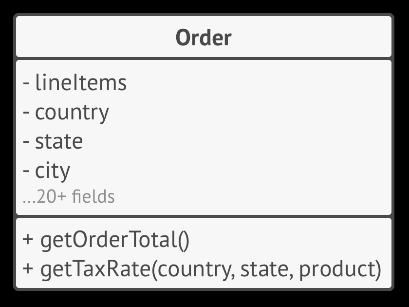
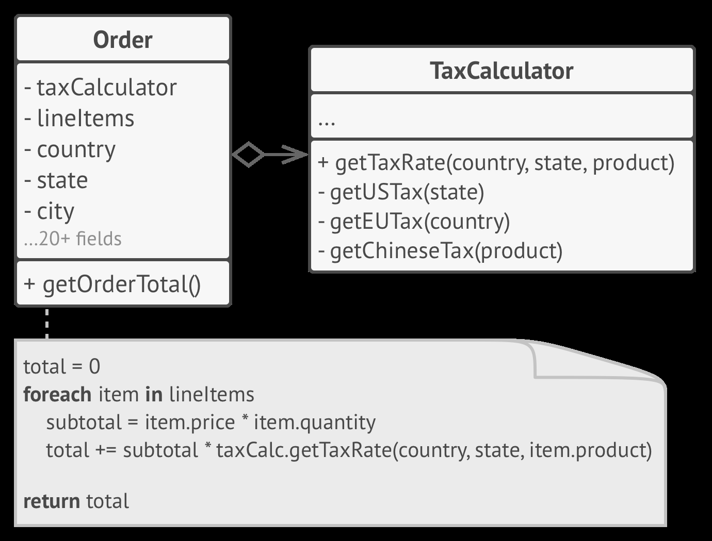

# SOFTWARE DESIGN PRINCIPLES

## Encapsulate What Varies
Identify the aspects of your application that vary and separate them from what stays the same. **The main goal of this principle is to minimize the effect caused by changes.**

## Encapsulation on a method level
Here is the `getOrderTotal` function converted to C++:

```cpp
#include <iostream>
#include <vector>
#include <string>

using namespace std;

struct LineItem {
    double price;
    int quantity;

    LineItem(double p, int q) : price(p), quantity(q) {}
};

struct Order {
    string country;
    vector<LineItem> lineItems;

    Order(const string& c) : country(c) {}

    void addItem(double price, int quantity) {
        lineItems.emplace_back(price, quantity);
    }
};

double getOrderTotal(const Order& order) {
    double total = 0;

    // Calculate total price of line items
    for (const auto& item : order.lineItems) {
        total += item.price * item.quantity;
    }

    // Apply tax based on country
    if (order.country == "US") {
        total += total * 0.07; // US sales tax
    } else if (order.country == "EU") {
        total += total * 0.20; // European VAT
    }

    return total;
}

int main() {
    // Example usage
    Order order("US");
    order.addItem(100.0, 2); // Add item with price 100 and quantity 2
    order.addItem(50.0, 1);  // Add item with price 50 and quantity 1

    cout << "Total Order Cost: $" << getOrderTotal(order) << endl;

    return 0;
}
```
**You can extract the tax calculation logic into a separate method, hiding it from the original method.**

---
#### Refactored Code 

```cpp
#include <iostream>
#include <vector>
#include <string>

using namespace std;

struct LineItem {
    double price;
    int quantity;

    LineItem(double p, int q) : price(p), quantity(q) {}
};

struct Order {
    string country;
    vector<LineItem> lineItems;

    Order(string c) : country(c) {}

    void addItem(double price, int quantity) {
        lineItems.emplace_back(price, quantity);
    }
};

double getTaxRate(const string& country) {
    if (country == "US") {
        return 0.07; // US sales tax
    } else if (country == "EU") {
        return 0.20; // European VAT
    }
    return 0.0; // No tax for other countries
}

double getOrderTotal(const Order& order) {
    double total = 0.0;

    for (const auto& item : order.lineItems) {
        total += item.price * item.quantity;
    }

    total += total * getTaxRate(order.country);
    return total;
}

int main() {
    // Example usage
    Order order("US");
    order.addItem(100.0, 2);
    order.addItem(50.0, 1);

    cout << "Order Total: $" << getOrderTotal(order) << endl;

    return 0;
}
```
---

## Encapsulation on a class level

Extracting everything to a new class might make things much more clear and simple.

---
BEFORE: calculating tax in Order class

---
AFTER: tax calculation is hidden from the order class.

---

## Program to an Interface, not an Implementation