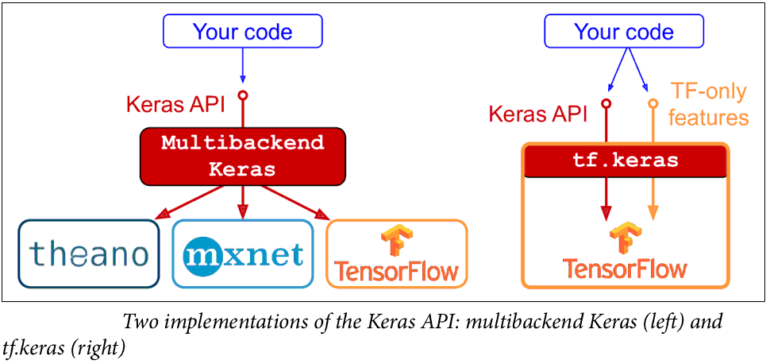
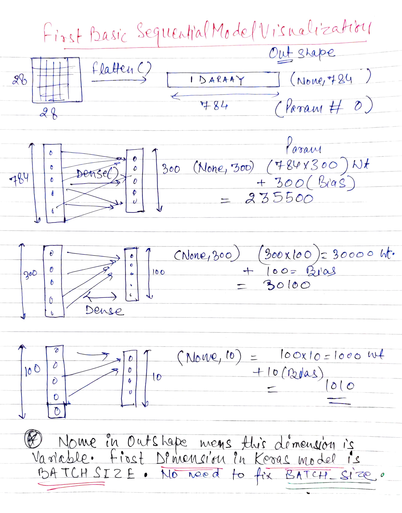
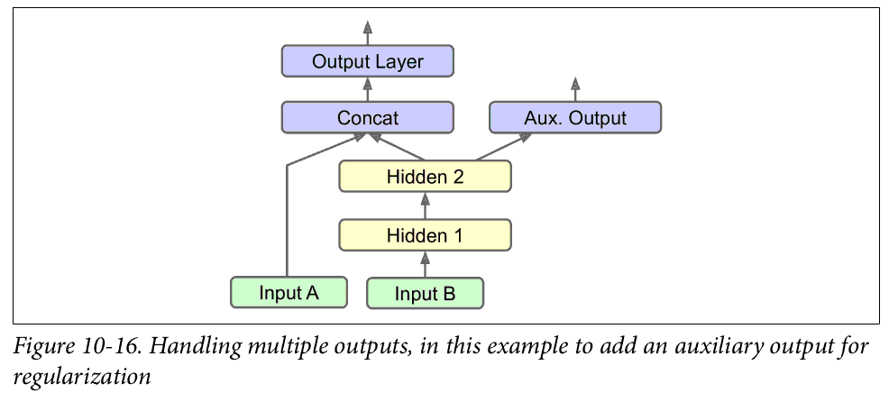

# Notes Introduction to Artificial Neural Networks with Keras

Implementing MLPs with Keras
----------------------------

Keras have below software implementations, tensorflow2 has has adopted Keras as its official high-level
API.


Building an Image Classifier Using the Sequential API
------------------------------------------------------
In this chapter we will tackle Fashion MNIST(70,000 grayscale images of 28 × 28 pixels each, with 10 classes).

````python
import tensorflow as tf
from tensorflow import keras

fashion_mnist = keras.datasets.fashion_mnist
(X_train_full, y_train_full), (X_test, y_test) = fashion_mnist.load_data()

X_train_full.shape
(60000, 28, 28)
###split into Train and Valid
X_valid, X_train = X_train_full[:5000] / 255.0, X_train_full[5000:] / 255.0
y_valid, y_train = y_train_full[:5000], y_train_full[5000:]
````

Creating the model using the Sequential API
-------------------------------------------

1. model = keras.models.Sequential()
2. model.add(keras.layers.Flatten(input_shape=[28, 28]))
3. model.add(keras.layers.Dense(300, activation="relu"))
4. model.add(keras.layers.Dense(100, activation="relu"))
5. model.add(keras.layers.Dense(10, activation="softmax"))

Let's analyse the above simple mode line by line

1. **Line1:** The first line creates a Sequential model. This is the simplest kind of Keras
model for neural networks that are just composed of a single stack of layers connected sequentially. This is called the Sequential API.

2. **Line2:** It is a Flatten layer whose role is to convert each input image into a 1D array: if it receives 
input data X, it computes X.reshape(-1, 1) . This layer does not have any parameters; it is just
there to do some simple preprocessing. Since it is the first layer in the model, **you
should specify the input_shape, which doesn’t include the batch size, only the
shape of the instances**.

3. **Line3:** Dense layer or Fully connected layer is, "A linear operation in which every input is connected to every 
output by a weight". According to tf2 documentation ***output = activation(dot(input, kernel) + bias)***.

#### Below are the model visualization and summary




We can easily get a model’s list of layers, to fetch a layer by its index, or you can fetch it by name and it's 
corresponding weights and biases.

````python
list_layers = model.layers
no_layers = len(list_layers)
hidden1 = model.layers[1]

>>weights, biases = hidden1.get_weights()
>>weights.shape
(784, 300)
>>biases
(300,)
````

#### Compiling the model:

Compile defines the *loss* function, the **optimizer** and the **metrics**. If you compile a model again, you will lose 
the **optimizer states**.

````python
model.compile(loss="sparse_categorical_crossentropy",
optimizer="sgd",
metrics=["accuracy"])
````

#### Training and evaluating the model

We can give the Train and validation data or *validation_split* ratio.

````python
history = model.fit(X_train, y_train, epochs=30, 
validation_data=(X_valid, y_valid))
##or
history = model.fit(X_data, y_data, epochs=30,
                        validation_split=0.2)
````

###### we can also print the model with kers utils

````python
keras.utils.plot_model(model, "my_fashion_mnist_model.png", show_shapes=True)
````


The fit() method returns a History object containing the training parameters( **history.params** ), the list of epochs it went through ( **history.epoch** ), and most
importantly a **dictionary ( history.history ) containing the loss and extra metrics** it measured at the end of each epoch on the training set and on the validation set (if any). 

If you use this dictionary to create a pandas DataFrame and call its plot()
method, you get the learning curves like below.


Building Complex Models Using the Functional API
------------------------------------------------

Let us code below model

1. input_A = keras.layers.Input(shape=[5], name="wide_input")
2. input_B = keras.layers.Input(shape=[6], name="deep_input")
3. hidden1 = keras.layers.Dense(30, activation="relu")(input_B)
4. hidden2 = keras.layers.Dense(30, activation="relu")(hidden1)
5. concat = keras.layers.concatenate([input_A, hidden2])
6. output = keras.layers.Dense(1, name="output")(concat)
7. model = keras.Model(inputs=[input_A, input_B], outputs=[output])
Let understand the lines and anaylse it with the model.sumarry():

- Line1 and 2 First, we need to create an Input object.
- Line 3 & 4 hidden layers
- Line 5 Clear from the above model.summary output, it takes two features and emebd them in series.
- Line 7 Create model , specifying which inputs and outputs to use., Note inputs=[input_A, input_B] when creating the 
  model.
  


****

###### Now we can compile the model as usual, but when we call the fit() method, instead of passing a

###### single input  matrix X_train, we must pass a pair of matrices (X_train_A, X_train_B) like below.

````python
history = model.fit((X_train_A, X_train_B), y_train, epochs=20,
validation_data=((X_valid_A, X_valid_B), y_valid))
````

##### Multi input and output model



```python
# Same as above, up to the main output layer
output = keras.layers.Dense(1, name="main_output")(concat)
aux_output = keras.layers.Dense(1, name="aux_output")(hidden2)
model = keras.Model(inputs=[input_A, input_B], outputs=[output, aux_output])
```
Each output will need its own loss function. Therefore, when we compile the model,
we should pass a list of losses. *Alternatively, you can pass a dictionary that maps each output name to the corresponding loss. 
Just like forthe inputs, this is useful when there are multiple outputs, to avoid getting the order wrong. The loss weights
and metrics (discussed shortly) can also be set using dictionaries.*
By default, Keras will compute all these losses and simply add them up to get the final loss used for training. We care much more
about the main output than about the auxiliary output (as it is just used for regulari‐
zation), so we want to give the main output’s loss a much greater weight. Fortunately,
it is possible to set all the loss weights when compiling the model:

```python
model.compile(loss=["mse", "mse"], loss_weights=[0.9, 0.1], optimizer="sgd")
history = model.fit([X_train_A, X_train_B], [y_train, y_train], epochs=20, validation_data=([X_valid_A, X_valid_B], 
[y_valid, y_valid]))
```

Saving and Restoring a Model
-------------------------------

Keras will use the HDF5 format to save both the model’s architecture (including every
layer’s hyperparameters) and the values of all the model parameters for every layer
(e.g., connection weights and biases). It also saves the optimizer (including its hyper‐
parameters and any state it may have)

```python
model.save("my_keras_model.h5")
model = keras.models.load_model("my_keras_model.h5")
```

***
*The above mechanism of save and load only with SEQUENTIAL APIS or FUNCTIONAL APIS. Not when using model subclassing(i.e define your own* 
*Model class by inherting keras.Model) You can use save_weights() and load_weights() to at least save and restore the model parameters, but you will need to* 
*save and restore everything else yourself.*


Using Callbacks
---------------

The fit() method accepts a callbacks argument that lets you specify a list of objects
that Keras will call at the start and end of training, at the start and end of each epoch,
and even before and after processing each batch.

- ModelCheckpoint
callback saves checkpoints of your model at regular intervals during training, by
default at the end of each epoch. Moreover, if you use a validation set during training, you can set
save_best_only=True when creating the ModelCheckpoint

```python
checkpoint_cb = keras.callbacks.ModelCheckpoint("my_keras_model.h5", save_best_only=True)
history = model.fit(X_train, y_train, epochs=10, validation_data=(X_valid, y_valid),
callbacks=[checkpoint_cb])
model = keras.models.load_model("my_keras_model.h5")
```

- EarlyStopping callback. It will interrupt training when it measures no progress on the validation set for number of epochs (defined by the patience argument), and it will optionally roll
back to the best model.
```python
early_stopping_cb = keras.callbacks.EarlyStopping(patience=10, restore_best_weights=True)
history = model.fit(X_train, y_train, epochs=100, validation_data=(X_valid, y_valid),
callbacks=[checkpoint_cb, early_stopping_cb])
```


