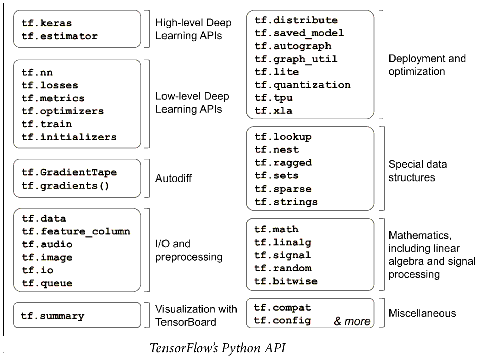

# Custom Models and Training with TensorFlow
A Quick Tour of TensorFlow
--------------------------
Below is the API stack for the tensorflow2.

Tensorflow2 architecture is below. Now and onwards we will abbreviate tensorflow2 as (TF2 or tf2). 

