# Deep Computer Vision Using Convolutional Neural Networks

**CNN Layers**
----------

Figure below shows CNN on RGB(3 channel) image.


In TensorFlow, each input image is typically represented as a 3D tensor of shape [height, width, channels]. A 
mini-batch is represented as a 4D tensor of shape \[mini-batch size, height, width, channels](NHWC).

### Pooling Layers
--------------

`global average pooling layer`, it works very differently: all it does is compute the mean of each entire feature map 
(it’s like an average pooling layer using a pooling kernel with the same spatial dimensions as the inputs). This means 
that it just outputs a single number per feature map and per instance. Although this is of course extremely destructive
(most of the information in the feature map is lost), it can be useful as the output layer, as we will see later in 
this chapter. To create such a layer, simply use the keras.layers.GlobalAvgPool2D class:
`global_avg_pool=keras.layers.GlobalAvgPool2D()`

Figure below is an example of **GlobalAvgPool2D** pooling layer output is the average of each layer.

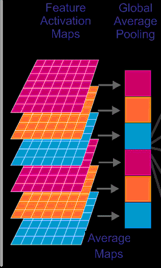

**CNN Architectures**
-----------------
### GoogLeNet


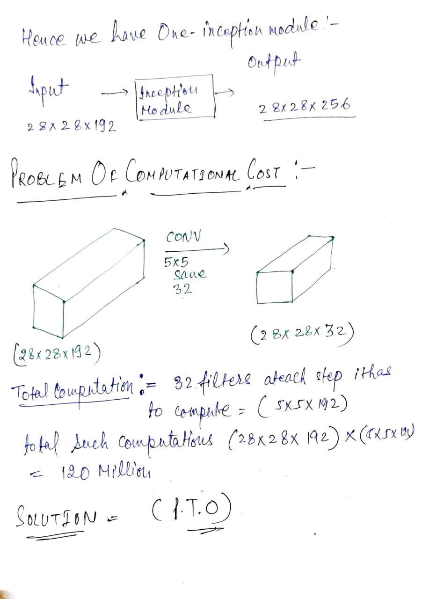

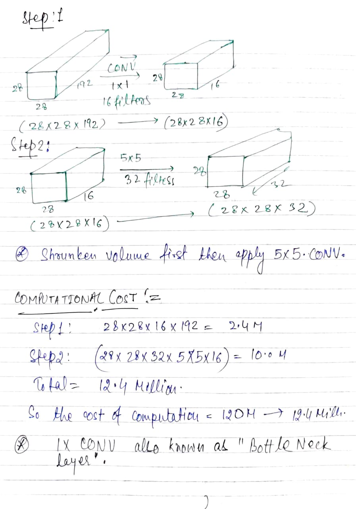

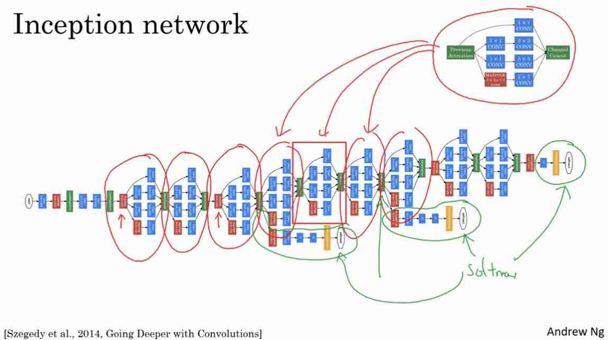

#### ResNet


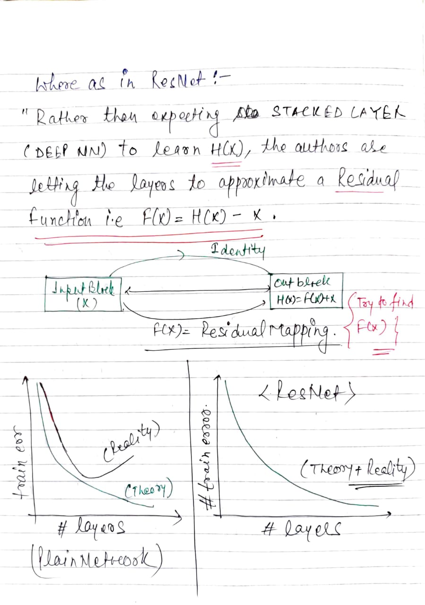

### Xception

Another variant of the GoogLeNet architecture is worth noting: Xception 19 (which stands for Extreme Inception) was
proposed in 2016 by François Chollet (the author of Keras), and it significantly outperformed Inception-v3 on a huge
vision task (350 million images and 17,000 classes). Just like Inception-v4, it merges the ideas of GoogLeNet and 
ResNet, but it replaces the inception modules with a special type of layer called a depthwise separable convolution 
layer (or separable convolution layer for short 20 ).

Thus, it is composed of two parts: the first part applies a single spatial filter for each input feature map, 
then the second part looks exclusively for cross-channel patterns—it is just a regular convolutional layer with 1 ×
1 filters. Refer image below:


***Since separable convolutional layers only have one spatial filter per input channel, you should avoid using them*** 
***after layers that have too few channels, such as the input layer (granted, that’s what Figure above represents,*** 
***but it is just for illustration purposes)****. For this reason, the Xception architecture starts with 2 regular convolutional
layers, but then the rest of the architecture uses only separable convolutions (34 in
all), plus a few max pooling layers and the usual final layers (a global average pooling
layer and a dense output layer).


### SENet

The winning architecture in the ILSVRC 2017 challenge was the Squeeze-and-
Excitation Network (SENet). 22 This architecture extends existing architectures such as inception networks and ResNets, and boosts their performance. This allowed SENet
to win the competition with an astonishing 2.25% top-five error rate! The extended
versions of inception networks and ResNets are called SE-Inception and SE-ResNet,
respectively. The boost comes from the fact that a SENet adds a small neural network,
called an SE block, to every unit in the original architecture (i.e., every inception
module or every residual unit), as shown in Figure below:

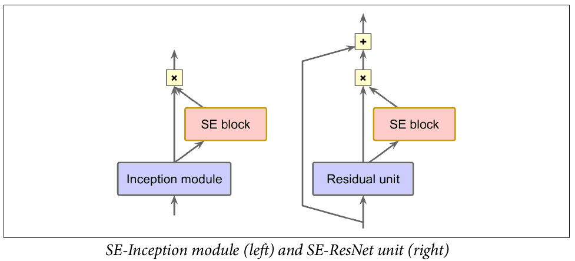

 CNN network weights each of its channels equally when creating the output feature maps. SENets are all about changing this by adding a content aware mechanism to weight each channel adaptively. 

 #### HOW:

```python
def se_block(in_block, ch, ratio=16):
    x = GlobalAveragePooling2D()(in_block)
    x = Dense(ch//ratio, activation='relu')(x)
    x = Dense(ch, activation='sigmoid')(x)
    return multiply()([in_block, x])

```

1. The function is given an input convolutional block and the current number of channels it has.

2. We squeeze each channel to a single numeric value using 2D average pooling.

3. A dense layer followed by a ReLU function adds the necessary nonlinearity. It’s output channel complexity is also reduced by a certain ratio.

4. A dense layer followed by a Sigmoid activation gives each channel a smooth gating function.

5. At last, we weight each feature map of the convolutional block based on the result of our side network.(multiply step)

Refer below image for illustrative details:

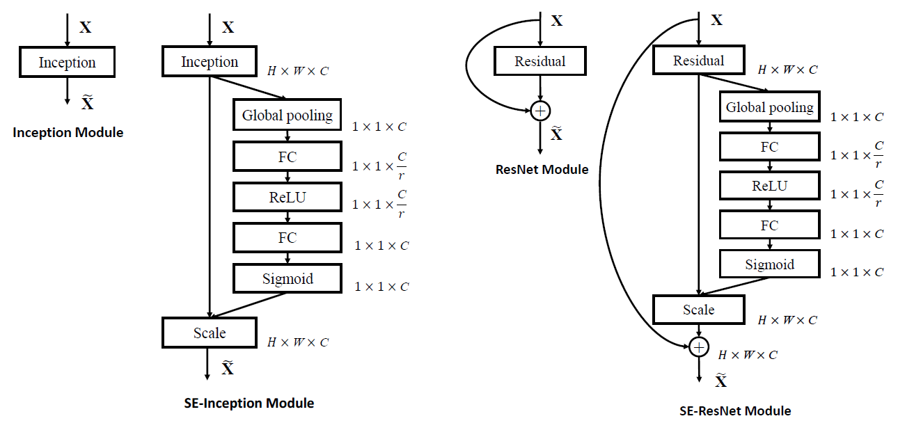

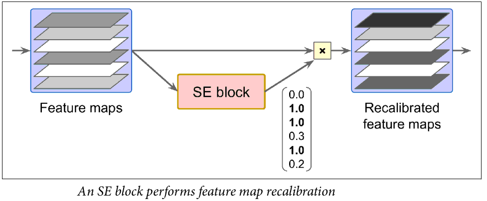

For example, an SE block may learn that
mouths, noses, and eyes usually appear together in pictures: if you see a mouth and a
nose, you should expect to see eyes as well. So if the block sees a strong activation in the mouth and nose feature maps, but only mild activation in the eye feature map, it will boost the eye feature map **(more accurately, it will reduce irrelevant feature maps because no multiply scale factor can be more than 1.0 hence reduce the irrelevant fatures by multiplying a small scale factor)**. If the eyes were somewhat confused with something else, this feature map recalibration will help resolve the ambiguity.


**Object Detection and Segmentation**
---------------------------------

### 1. Fast and Faster R-CNN

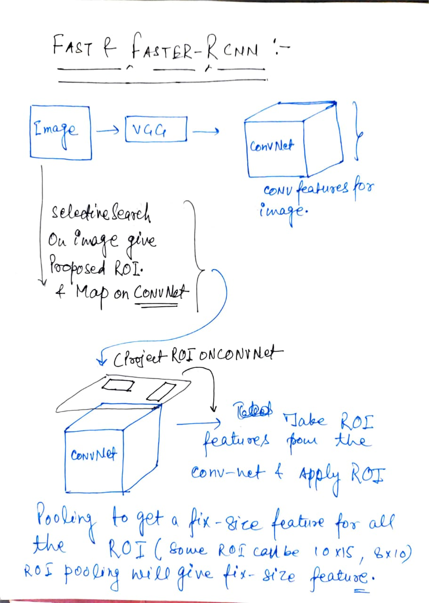

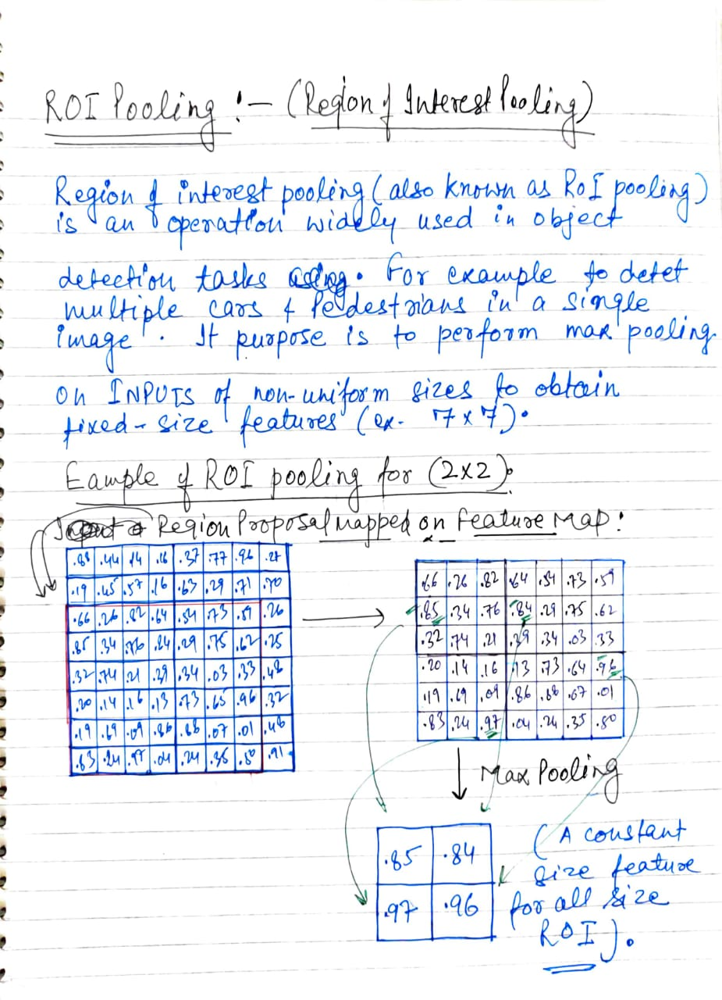


#### <ins>References:</ins>

1. [Deep learning for all at Manas lab IIT Mandi](https://youtu.be/CKVuTe4nHgI?list=PLKvX2d3IUq58z6Ogtqm_Ni3TNdL3w2r5P)

2. [Understanding Region of Interest — (RoI Pooling)](https://towardsdatascience.com/understanding-region-of-interest-part-1-roi-pooling-e4f5dd65bb44)

3. [Understanding Region of Interest — (RoI Align and RoI Warp)](https://towardsdatascience.com/understanding-region-of-interest-part-2-roi-align-and-roi-warp-f795196fc193)

4. [Faster R-CNN (object detection) implemented by Keras](https://towardsdatascience.com/faster-r-cnn-object-detection-implemented-by-keras-for-custom-data-from-googles-open-images-125f62b9141a)

5. [Faster R-CNN (object detection) implemented by Keras Git Link](https://github.com/RockyXu66/Faster_RCNN_for_Open_Images_Dataset_Keras)

### 2. Mask R-CNN

Mask R-CNN is a state-of-the-art model for instance segmentation. It extends Faster R-CNN, the model used for object detection, by adding a parallel branch for predicting segmentation masks.


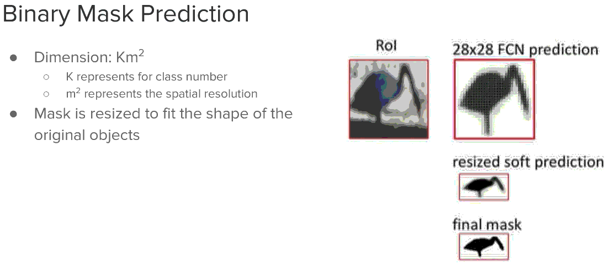


#### <ins>References:</ins>

1. [Mask R-CNN](https://cseweb.ucsd.edu/classes/sp18/cse252C-a/CSE252C_20180509.pdf)

2. [Quick intro to Instance segmentation: Mask R-CNN](https://kharshit.github.io/blog/2019/08/23/quick-intro-to-instance-segmentation)

### 3. Feature Pyramid Networks for Object Detection